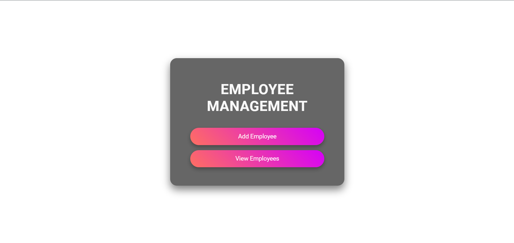
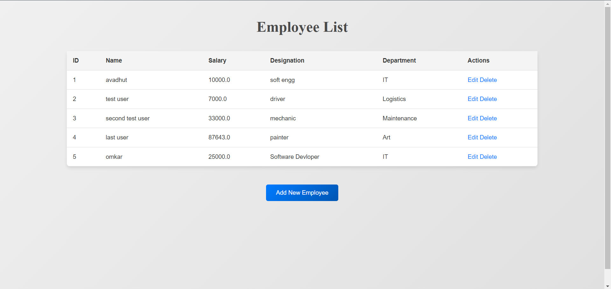
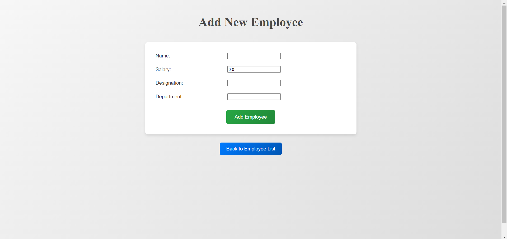
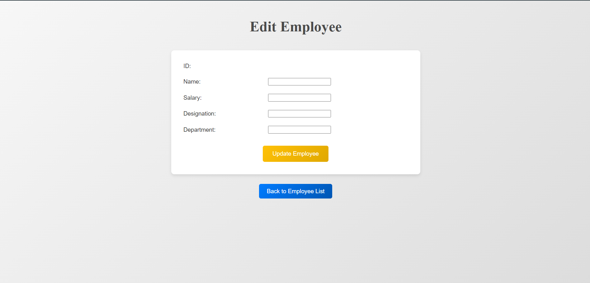

# Employee Management System

Welcome to the **Employee Management System** project! 🎉 This application is designed to help manage employee records efficiently with a modern and user-friendly interface using `spring` operation.

## 🛠 Technologies Used

- **Spring** - For building and running the Java application.
- **JSP** - For rendering dynamic web pages.
- **CSS** - For styling the web pages.
- **H2** - For database management (if applicable).
- **Maven** - For project management and build automation.

## 📋 Features

- **Add Employee**: Quickly add new employee records.
- **Edit Employee**: Update existing employee details.
- **Employee List**: View all employees with options to edit or delete.
- **Delete Employee**: Remove employee records from the system.

## 🖥️ How to Run

1. **Clone the repository:**

    ```bash
    git clone https://github.com/OmkarJadhav98/spring-example.git
    ```

2. **Navigate to the project directory:**

    ```bash
    cd spring-mvc-crud
    ```

3. **Build the project with Maven:**

    ```bash
    mvn clean install
    ```

4. **Run the application:**

    ```bash
    mvn spring-boot:run
    ```

5. **Open your web browser and go to:**

    ```
    http://localhost:8080/view
    ```

## 🖼️ Screenshots

### Employee Management



### Employee List



### Add Employee



### Edit Employee



## 🎨 UI/UX Design

The UI is designed with a modern, clean, and responsive look, ensuring ease of use on various devices. Buttons have sleek gradients and hover effects to enhance the user experience.

## 📄 API Endpoints

- **GET** `/view` - List all employees.
- **GET** `/add` - Show the form to add a new employee.
- **POST** `/save` - Save a new employee record.
- **GET** `/edit/{id}` - Show the form to edit an existing employee.
- **POST** `/update` - Update an existing employee record.
- **GET** `/delete/{id}` - Delete an employee record.

## 📂 Project Structure

- **`src/main/java`**: Contains Java source files.
- **`src/main/resources`**: Contains configuration files and application properties.
- **`src/main/webapp/WEB-INF/jsp`**: Contains JSP files for rendering views.
- **`pom.xml`**: Maven build configuration file.

## 🤝 Contributing

We welcome contributions! If you'd like to contribute, please follow these steps:

1. Fork the repository.
2. Create a new branch (`git checkout -b feature-branch`).
3. Make your changes.
4. Commit your changes (`git commit -am 'Add some feature'`).
5. Push to the branch (`git push origin feature-branch`).
6. Create a new Pull Request.

## 📧 Contact

For any questions or feedback, please reach out to [objadhav28@gmail.com](mailto:objadhav28@gmail.com).

## 📝 License

This project is licensed under the MIT License - see the [LICENSE](LICENSE) file for details.

---

Happy coding! 🚀
